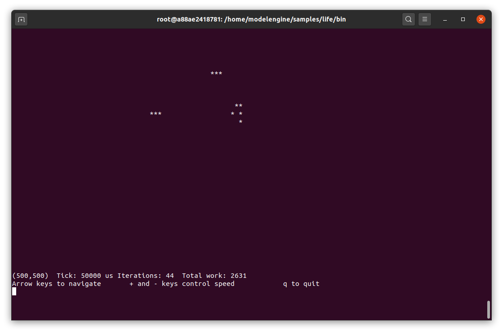
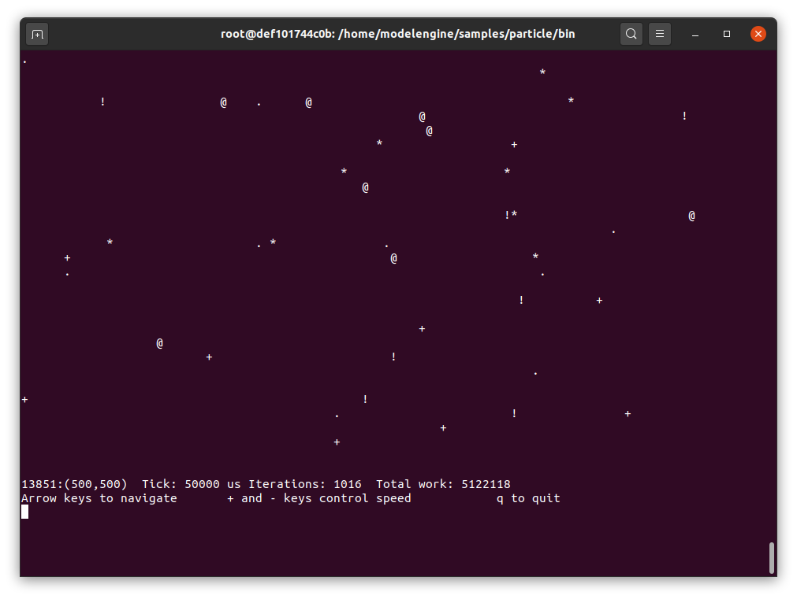
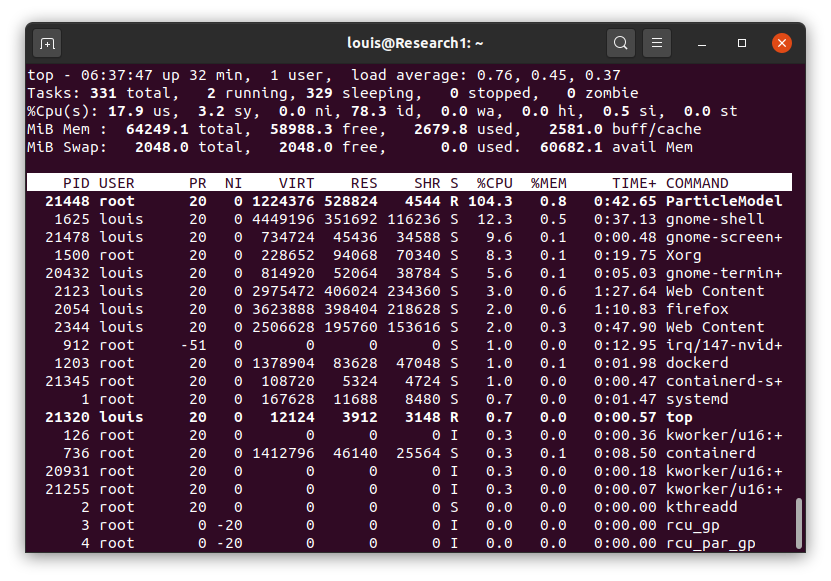
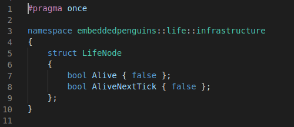
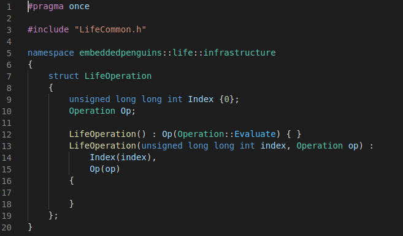

# Model Engine
## A C++ Engine to efficiently execute Finite-State Automata with all available cores

This project was originally motivated as a platform to efficiently run spiking neural
networks on CPU.  All neural networks can be thought of as a particular implementation
of a finite-state automata; the thing about  *spiking* neural networks (as distinct from the
more static kind used in most deep learning) is that spiking neural networks are sparse.
That is, at any given time, only a very small fraction of the neurons in the network
are actually doing anything.

This sparsity provides an opportunity for runtime efficiencies if you can find a way
to ignore the vast majority of neurons in the network that are not currently processing
information (e.g., spiking now, processing recent inputs from upstream spiking neurons,
in refractory phase, etc.).

In the process of developing something that can efficiently run sparse spiking neural
networks, it became clear that this really should be abstracted to a general purpose
engine to execute any kind of finite-state automata.  This repo is the result of that
abstraction effort.

In order to demonstrate its use, I have included two samples:
- John Conway's game of Life
- A simplified plasma of particles propagating through space.

<br> <a name="contents"></a>
Contents
--------

* [License](#license)
* [Getting Started](#getting-started)
* [Programming to the SDK](#programming-to-the-sdk)
    * [The four required classes](#the-four-required-classes)
        * [The model *Node* class](#the-model-node-class)
        * [The model *Operation* class](#the-model-operation-class)
        * [The model *Implementation* class](#the-model-implementation-class)
        * [The model *Record* class](#the-model-record-class)


## License
-------

ModelEngine: Header-only C++ library to efficiently make use of all available cores while running a finite-state automata.


The class is licensed under the [MIT License](http://opensource.org/licenses/MIT):

Copyright &copy; 2020 [Louis Ross](louis.ross@gmail.com)

Permission is hereby granted, free of charge, to any person obtaining a copy of this software and associated documentation files (the “Software”), to deal in the Software without restriction, including without limitation the rights to use, copy, modify, merge, publish, distribute, sublicense, and/or sell copies of the Software, and to permit persons to whom the Software is furnished to do so, subject to the following conditions:

The above copyright notice and this permission notice shall be included in all copies or substantial portions of the Software.

THE SOFTWARE IS PROVIDED “AS IS”, WITHOUT WARRANTY OF ANY KIND, EXPRESS OR IMPLIED, INCLUDING BUT NOT LIMITED TO THE WARRANTIES OF MERCHANTABILITY, FITNESS FOR A PARTICULAR PURPOSE AND NONINFRINGEMENT. IN NO EVENT SHALL THE AUTHORS OR COPYRIGHT HOLDERS BE LIABLE FOR ANY CLAIM, DAMAGES OR OTHER LIABILITY, WHETHER IN AN ACTION OF CONTRACT, TORT OR OTHERWISE, ARISING FROM, OUT OF OR IN CONNECTION WITH THE SOFTWARE OR THE USE OR OTHER DEALINGS IN THE SOFTWARE.

* * *
The software contains the Json header-only library from Niels Lohmann which is licensed under the MIT License. 
Copyright © 2013-2019 Niels Lohmann mail@nlohmann.me

## Getting Started
---------------

The easiest way to see the engine in action is to build and run the samples.  The easiest
way to do that is to use the included Docker image.

This reduces the dependencies considerably.  You will need:
1. A Linux system capable of running Docker; and
2. Docker.

If you are running Ubuntu, check out Docker installation instruction [here](https://docs.docker.com/engine/install/ubuntu/).

If you are running another Linux distro, look into the Docker installation instructions at [dockerhub](https://hub.docker.com/search?type=edition&offering=community).

Once you have the Docker Engine successfully installed on your system, and have given yourself permissions 
to run Docker commands, if necessary, the steps are simple:

1. Create a folder for the source code.  Let's say ~/source.
2. `> cd ~/source`
3. `> git clone https://github.com/LouisRoss/modelengine.git`
4. `> cd modelengine`
5. `> ./dockb`
6. `> ./dock`

At this point, you should have built the docker image and are running it on the same console. 
It will be running as root, in a directory `/home/modelengine`.

You can build and run the samples like this.  The samples use a primitive text-only GUI,
so don't depend on any graphics.

1. `# cd samples/life/source`
2. `# make`
3. `# cd ../bin`
4. `# ./LifeModel life1`

or

1. `# cd samples/particle/source`
2. `# make`
3. `# cd ../bin`
4. `# ./ParticleModel particle1`

In either case, you should build and run one of the samples.  The primitive GUI assumes you have
set your terminal screen to at least 27 rows deep by 50 columns wide.  You should see a tiny
window onto a 1000 X 1000 grid of cells, operating the specified sample.

Here is a sample run of the Game of Life sample:



The console updates continuously, so it is good that the model engine keeps one 
hardware core in reserve.  The game board is only initialzed with a few 'living' 
cells, and is not intended to showcase the game of life, only to show that coding
it with the Model Engine is straightforward.

Here is a sample run of the Particle simulator:



In this example, the model is tracking around 13,000 particles of different types, each
tick of the simulation is 50 milliseconds, we have executed 1,016 ticks, processing
5,122,118 individual particle behaviors.  Again, the console updates continuously, 
and any particles within the small window are displayed as they bounce about.

With both samples, there are some single-key commands you can use to steer around
the wider simulation space, control the simuation speed (tick speed in microseconds), 
and quit.  See the legend at the bottom.

## A bit more about the particle simulation

There are actually 15,625 particles in the particle simulation (when it is set to its default
100 X 1000 size), only about 13,000 of which were present in the model at the time of the 
screenshot above.  The rest were in the work queue of the Model Engine, 
waiting to be processed during the next tick.  The way the simulation works is to propagate 
particles by calculating what cell they should propagate to, signaling the Model Engine to 
perform the necessary work the create the particle in that new cell, then erasing the 
particle from its current cell.  During the intervening Model Engine tick, 
the particle is 'in flight', existing only in the Model Engine's work queue.

The screenshots above were taken on a quad-core Intel I7 with hyperthreading, so
a machine with eight available hardware threads.  The Model Engine works in two phases,
first partitioning work among the available threads, then signaling all the worker
threads to consume their partitioned work.  The partitioner guarantees that no two
threads will operate on the same model cell, resulting in lockless operation while
running the model.

Here is a snapshot of the host load while the particle snapshot above (running
in a Docker container) was being taken:



Overall CPU usage was 17.9%, which, given eight effective cores, is equivalent to 104%
of a single core.  If the average work performed per tick is 5,122,118 / 1,016 = 5,041
and the tick speed is 50 milliseconds, or 20 ticks / seconds, then the work item
rate is 5,041 * 20, or around 100,800 work items per second.

The Particle sample is designed to act as a performance load the Model Engine while running
a non-trivial model.  You can easily vary the load by changing the model size in configuration
(see the configuration section below) or using the +/- keys while the model is running
to set the tick speed faster or slower.

## Programming to the SDK
-------------------------

The included `dockb` and `dock` scripts build a Docker image and run it as a container, respectively.
When the Docker container is running, it has a *bind mount* between the modelengine project
folder on your host and a folder inside the Docker container at `/home/modelengine`.  This means
that these folders are shared between the host and the container -- what happens to files on the
host happens to them inside the container, and vice versa.

This is a long way of saying that the rest of this discussion will assume that you are
building and running inside the Docker container as detailed in [Getting Started](#getting_started)
above, but all the code locations will assume that you run an editor outside the container,
in your host machine.  It doesn't matter where you edit code, it will compile and run inside
the container just fine.

The *Software Development Kit (SDK)* refers to several files in `modelengine/include/sdk`.
Your primary interface to the Model Engine will be a class called `ModelRunner`, defined in
an SDK file `ModelRunner.h'.

Here is the full code for the Game of Life sample program's `main()` function.

```cpp
///////////////////////////////////////////////////////////////////////////
//Main program entry.
//Run the game of life model.
//
int main(int argc, char* argv[])
{
    ParseArguments(argc, argv);
    ModelRunner<LifeNode, LifeOperation, LifeImplementation, LifeRecord> modelRunner(argc, argv);

    auto& configuration = modelRunner.Configuration();
    auto dimensionElement = configuration["Model"]["Dimensions"];
    if (dimensionElement.is_array())
    {
        auto dimensionArray = dimensionElement.get<vector<int>>();
        width = dimensionArray[0];
        height = dimensionArray[1];
    }
    centerWidth = width / 2;
    centerHeight = height / 2;

    if (!modelRunner.Run())
    {
        cout << "Cannot run model, stopping\n";
        return 1;
    }

    PrintAndListenForQuit(modelRunner);

    modelRunner.WaitForQuit();
    return 0;
}
```

Disregarding as application-specific the calls to `ParseArguments()` and `PrintAndListenForQuit()`, this code is a great
showcase for the major elements of the ModelEngine SDK:

- The `ModelRunner` instance, `modelRunner`.  Just create a `ModelRunner` instance and tell it to 
run and quit when desired.  
- In order to create a `ModelRunner` instance, you need to create the [four required classes](#four_required_casses)
and pass them to the `ModelRunner` declaration as template arguments.  
All of the code defining the attributes and behavior of the model are contained in these four classes.  
- You have access to a Json object with configuration information (through use of the most excellent [nlohmann/json](https://github.com/nlohmann/json) software).  Use of the json object to get the configured width and height of the
Game of Life board is shown.
- When you are ready to go, just call `modelRunner.Run()`.  If for some reason the model can't be run,
the method will return false.  If `Run()` returns true, the Model Engine will run within its own threads,
returning immediately to you.
- Do whatever useful work you need to do while the Model Engine is running.  When you are ready to
stop it, just call `modelRunner.WaitForQuit()`.  It will return only after all threads have cleaned up
and been joined.  If you want to start the shutdown process while you do other things, call `modelRunner.Quit()`
before `modelRunner.WaitForQuit()`.


### The four required classes
----------------------------

In order to create an instance of the `ModelRunner` class, you must provide four class types
as template arguments.  These four classes are:
- **The model Node class**.  A *model* is a (potentially very large) vector of this class.
- **The model Operation class**.  The *operation* class carries any information needed by your code to perform operations on nodes of the model.
- **The model Implemetation class**.  This class implements the operations on nodes as described by the two classes above.  
- **The model record class**.  Using this class allows you to create a record of any interesting state changes that happen to your model, and save the record as a CSV file at the end of a run.

### The model *Node* class
--------------------------
This class defines what can be represented in a single cell of your automata *model*.  The whole *model* is a vector of this class.  The vector can be as large as you need it to be.  If the automata needs to be interpreted as a 2-dimensional array, as in the Game of Life, it is up to you to impose that structure on the 1-dimensional vector.

In the `Life` sample, this class is actually a struct called `LifeNode`.  It has only two public fields indicating whether the cell it represents is alive and whether the same cell should be alive next tick.



### The model *Operation* class
-------------------------------
The model progresses from tick to tick by performing operations on model nodes.  The *operation* class contains any information needed by your code to indicate what operation should be done during a tick.  

In the `Life` sample, this class is a struct called `LifeOperation`.  It has a public field of type `Operation`, which is an enum with two values, `Evaluate` and `Propagate`.



**BIG IMPORTANT NOTE**: The *operation* class **MUST** contain an field of type `unsigned long
long int` named `Index`.  You will get many long and opaque error messages from the compiler
if you leave this out.

### The model *Implementation* class
------------------------------------
This class implements the operations on nodes as described by the two classes above.  In the `Life` sample, this class is called `LifeImplementation`.

There are several aspects of this class that are required, and are listed here:
- This class must be derived from the Model Engine class `WorkerThread`.  In addition, the base class `WorkerThread` must be specialized with template arguments specifying the model's *operation*, *implementation* (this class), and *record* classes.
- You must supply a constructor that takes the worker id (what thread this instance runs on), the model (the vector of *node* classes), and a reference to the Json configuration being used.  More on this below.
- You must supply a method called `Initialize()`.  If model-specific initialialization needs to be done, one instance of this class will be called on its `Initialize()` method.  Most of the heavy lifting for model initialization is now done through the *initializer*, which we will get to below.  This method is seldom used.
- You must supply a method called `Process()`.  Once all work items have been partitioned among all the worker threads, each instance of this class will be called on its `Process()` method with the work it needs to do before it returns.
- You must supply a method called `Finalize()`.  As with `Initialize()`, one instance of this class will be called to clean up as the Model Engine shuts down.

The important contractual expectation for this class is that it will accept a collection of work items, each of which will be expressed as an *operation* class object.  Each work item has an `Index` field, and it is required that the `Process()` method should never make any changes to the model other than to the node at `model[work.Index]`.  Different instances of this class will run on different hardware threads, and it is important that each thread write only to cells assigned to it.

```cpp
class LifeImplementation : public WorkerThread<LifeOperation, LifeImplementation, LifeRecord>
{
public:
    // Required constructor.
    LifeImplementation(int workerId, vector<LifeNode>& model, const json& configuration) :
        workerId_(workerId),
        model_(model),
        configuration_(configuration)
    {
        /* ... */
    }

    // Required Initialize method.  
    void Initialize(Log& log, Recorder<LifeRecord>& record, 
        unsigned long long int tickNow, 
        ProcessCallback<LifeOperation, LifeRecord>& callback)
    {
    }

    // Required Process method.
    void Process(Log& log, Recorder<LifeRecord>& record, 
        unsigned long long int tickNow, 
        typename vector<WorkItem<LifeOperation>>::iterator begin, 
        typename vector<WorkItem<LifeOperation>>::iterator end, 
        ProcessCallback<LifeOperation, LifeRecord>& callback)
    {
        /* ... */
    }

    // Required Finalize method.
    void Finalize(Log& log, Recorder<LifeRecord>& record, unsigned long long int tickNow)
    {
    }
};
```

One important point to note about the *implementation* class is the last parameter of the
`Process()` method, `callback`.  This parameter is a reference to type `ProcessCallback`.
The `callback` parameter allows you to send an instance of the model *operation* class into
the Model Engine to be scheduled as an operation in a future tick.

Except for the injection of initial work into the model when it is first started, use of
this callback object is the only way that future operations on the model will be processed.

The callback is a functor object.  It is used by creating an instance of the model *operation* class and 
passing it to the callback as a function call:

```cpp
    callback(LifeOperation(cellIndex, Operation::Propagate));
```

### The model *Record* class
----------------------------
You may want to created a recording of all or some of the operations performed on the nodes
in your model.  To do this in the *implementation* class, use the reference to the `Recorder` 
class passed in to the methods of the *implementation* class.  This reference is called `record`,
and you use it by creating an instance of the model *record* class, and passing it to the `Record()` method.

```cpp
    record.Record(LifeRecord(LifeRecordType::Propagate, cellIndex, lifeNode));
```

The Model Engine keeps an in-memory vector of these records.  When the model run is over, this vector is written to a file on disk in CSV format.  You may use normal data processing tools to filter, sort, and evaluate the behavior of your model.

In the `Life` sample, the *record* class is called `LifeRecord`:

```cpp
#pragma once

#include <string>
#include <sstream>

#include "LifeCommon.h"
#include "LifeNode.h"

namespace embeddedpenguins::life::infrastructure
{
    using std::string;
    using std::ostringstream;

    enum class LifeRecordType
    {
        Evaluation,
        Propagate
    };

    struct LifeRecordEvaluation
    {
        unsigned long long int LifeIndex { };
    };

    struct LifeRecord
    {
        LifeRecordType Type { LifeRecordType::Evaluation };
        unsigned long long int LifeIndex { };
        bool Alive { false };

        LifeRecord(LifeRecordType type, unsigned long long int lifeIndex, const LifeNode& lifeNode) :
            Type(type),
            LifeIndex(lifeIndex),
            Alive(lifeNode.Alive)
        {
        }

        static const string Header()
        {
            ostringstream header;
            header << "Life-Event-Type,Life-Index,Life-Alive,u-l,up,u-r,right,l-r,lower,l-l,left";
            return header.str();
        }

        const string Format()
        {
            ostringstream row;
            row << (int)Type << "," << LifeIndex << "," << Alive << ",";
            switch (Type)
            {
                case LifeRecordType::Evaluation:

                    break;

                default:
                    row << "N/A,N/A";
                    break;
            }

            return row.str();
        }
    };
}
```

The `LifeRecord` class records an enum indicating the type of operation being recorded
(evaluation or propagation), the index of the node the operation occurred on, and a boolean
indicating whether the cell was alive or dead after the operation.

Note the static `Header()` method and the nonstatic `Format()` method.  These are required
for a class used as a model *record* class.  They are used at the end of the run to format
the header and rows of the CSV file that captures the recording.
